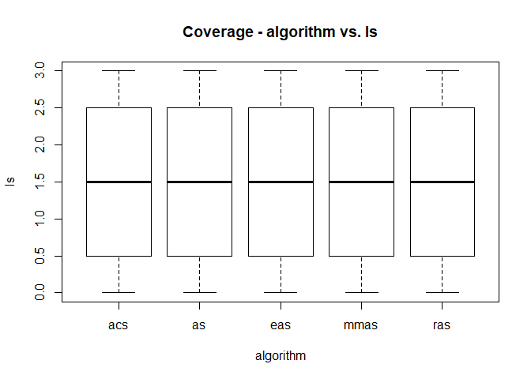
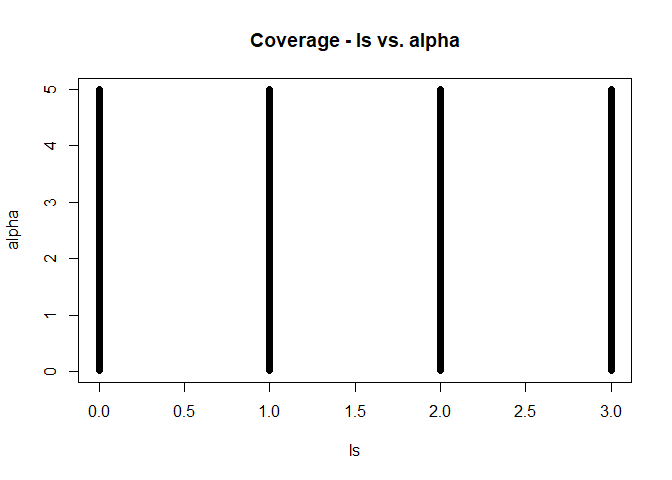
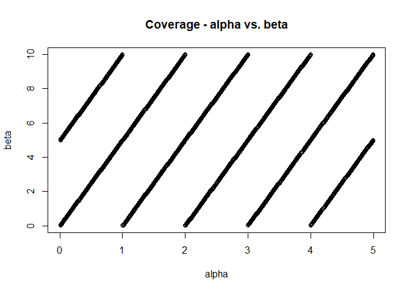
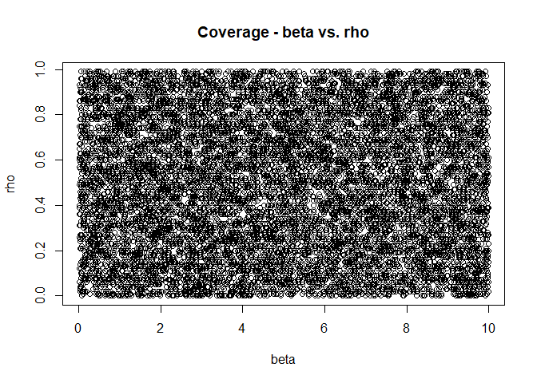
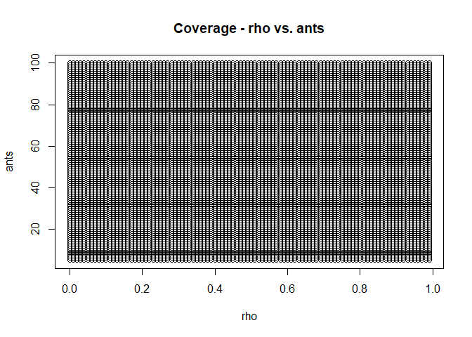
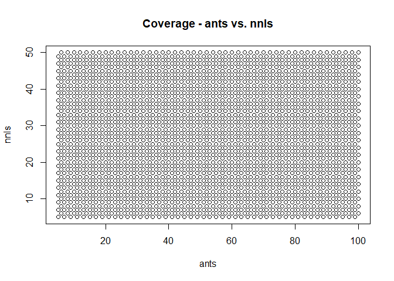
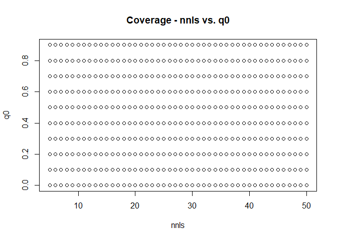
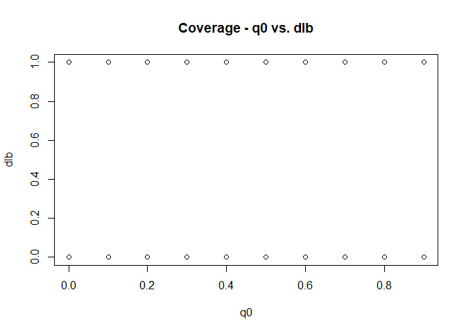
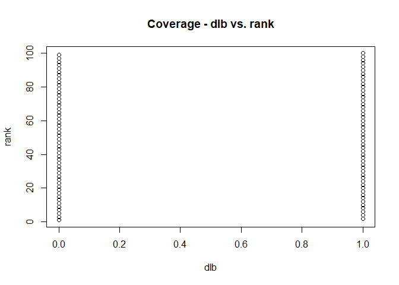
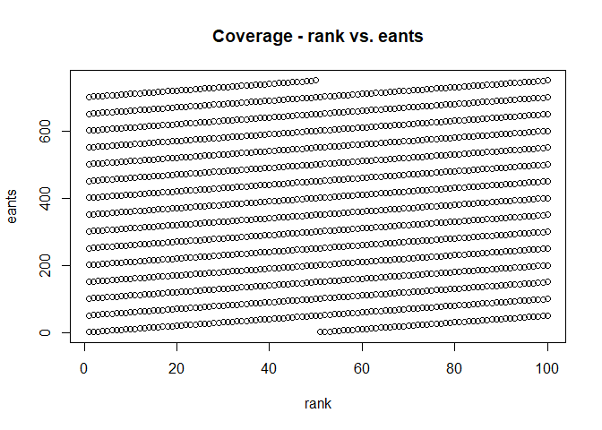

Abstract
--------

This analysis involves the generation of a sample in parameter space
that makes use of a Latin hypercube design. The sample size is to be
10,000 points covering 11 parameters with the following attributes:

    library(knitr)
    p_name <- c("algorithm","ls","alpha","beta","rho","ants","nnls","q0","dlb","rank","eants")
    p_type <-c("Categorical","Categorical","Real","Real","Real","Integer","Integer","Real","Categroical","Integer","Integer")
    p_range <- c("{'as','mmas','eas','ras','acs'}","{0,1,2,3}","[0.01, 5.00]","[0.01, 10.00]","[0.00, 1.00]","{5, 6, 7, ..., 100}","{5, 6, 7, ..., 50}","[0.0, 1.0]","{0,1}","{1, 2, 3, ..., 100}","{1, 2, 3, ..., 750}")
    p_levels <- c(5,4,Inf,Inf,Inf,96,46,Inf,2,100,750)
    kable(data.frame(Name=p_name,Data_Type=p_type,Range=p_range,Levels=p_levels))

<table>
<thead>
<tr class="header">
<th align="left">Name</th>
<th align="left">Data_Type</th>
<th align="left">Range</th>
<th align="right">Levels</th>
</tr>
</thead>
<tbody>
<tr class="odd">
<td align="left">algorithm</td>
<td align="left">Categorical</td>
<td align="left">{'as','mmas','eas','ras','acs'}</td>
<td align="right">5</td>
</tr>
<tr class="even">
<td align="left">ls</td>
<td align="left">Categorical</td>
<td align="left">{0,1,2,3}</td>
<td align="right">4</td>
</tr>
<tr class="odd">
<td align="left">alpha</td>
<td align="left">Real</td>
<td align="left">[0.01, 5.00]</td>
<td align="right">Inf</td>
</tr>
<tr class="even">
<td align="left">beta</td>
<td align="left">Real</td>
<td align="left">[0.01, 10.00]</td>
<td align="right">Inf</td>
</tr>
<tr class="odd">
<td align="left">rho</td>
<td align="left">Real</td>
<td align="left">[0.00, 1.00]</td>
<td align="right">Inf</td>
</tr>
<tr class="even">
<td align="left">ants</td>
<td align="left">Integer</td>
<td align="left">{5, 6, 7, ..., 100}</td>
<td align="right">96</td>
</tr>
<tr class="odd">
<td align="left">nnls</td>
<td align="left">Integer</td>
<td align="left">{5, 6, 7, ..., 50}</td>
<td align="right">46</td>
</tr>
<tr class="even">
<td align="left">q0</td>
<td align="left">Real</td>
<td align="left">[0.0, 1.0]</td>
<td align="right">Inf</td>
</tr>
<tr class="odd">
<td align="left">dlb</td>
<td align="left">Categroical</td>
<td align="left">{0,1}</td>
<td align="right">2</td>
</tr>
<tr class="even">
<td align="left">rank</td>
<td align="left">Integer</td>
<td align="left">{1, 2, 3, ..., 100}</td>
<td align="right">100</td>
</tr>
<tr class="odd">
<td align="left">eants</td>
<td align="left">Integer</td>
<td align="left">{1, 2, 3, ..., 750}</td>
<td align="right">750</td>
</tr>
</tbody>
</table>

Analysis
--------

The parameters of the LHS sample are determined by the number of unique
combinations of categorical and ordinal variables. More specifically it
will be the least common multiple of the number of levels in each such
variable. For example, if the first two variables had four unique
levels, then only four samples would be necessary to achieve uniform
coverage of all levels in both variables. Our first two variables have 5
and 4 unique levels, respecively, so a total of 20 combinations would be
necessary for uniform coverage. To determine the total number of
necessary combinations for all categorical and ordinal variables, we
find the least common multiple of all levels:

    library(pracma)
    Lcm(Lcm(Lcm(Lcm(Lcm(Lcm(5,4),96),46),2),100),750)

    ## [1] 276000

    Lcm(Lcm(Lcm(Lcm(Lcm(5,4),96),46),2),100)

    ## [1] 55200

    Lcm(Lcm(Lcm(Lcm(5,4),96),46),2)

    ## [1] 11040

Thus, our sample will be a length of 11040 and will achieve uniform
spread for all variables except rank and eants, who will at least
receive near uniform spread. The Latin hypercube sampling is performed
via the following:

    library(lhs)
    remainderOfMultiple <- function(x,n){x*n-floor(x*n)}
    floorWithDigits <- function(x,n){floor(x*(10^n))/(10^n)}
    x <- randomLHS(11040,1)
    xx <- x
    xtemp <- x*11040
    x <- cbind(x,as.integer(xtemp %% 5.0))
    x <- cbind(x,as.integer(xtemp %% 4.0))
    x <- cbind(x,floorWithDigits(remainderOfMultiple(xtemp,2)*4.99+0.01,2))
    x <- cbind(x,floorWithDigits(remainderOfMultiple(xtemp,5)*9.99+0.01,2))
    x <- cbind(x,floorWithDigits(xx,2))
    x <- cbind(x,as.integer(xtemp %% 96)+5)
    x <- cbind(x,as.integer(xtemp %% 46)+5)
    x <- cbind(x,floorWithDigits(remainderOfMultiple(xtemp,23),1))
    x <- cbind(x,as.integer(xtemp %% 2))
    x <- cbind(x,as.integer(xtemp %% 100)+1)
    x <- cbind(x,as.integer(xtemp %% 750)+1)

The first few lines are visible via the following:

    head(x)

    ##           [,1] [,2] [,3] [,4] [,5] [,6] [,7] [,8] [,9] [,10] [,11] [,12]
    ## [1,] 0.2194681    2    2 4.27 6.37 0.21   27   35  0.3     0    23   173
    ## [2,] 0.8114170    3    2 0.44 2.20 0.81   35   39  0.0     0    59   709
    ## [3,] 0.4761238    1    0 4.07 0.37 0.47   77   17  0.3     0    57     7
    ## [4,] 0.4134838    4    0 3.61 3.08 0.41   57   15  0.8     0    65    65
    ## [5,] 0.2728155    1    3 3.83 4.14 0.27   40   26  0.3     1    12    12
    ## [6,] 0.1111247    1    2 3.16 0.82 0.11   79   35  0.7     0    27   477

Finally, we load these values into a data frame with labeled columns,
converting the first column into its appropriate alphanumeric values

    algs <- c('as','mmas','eas','ras','acs')
    algtemp <- algs[x[,2]+1]
    xdf <- data.frame(algorithm=algtemp,ls=x[,3],alpha=x[,4],beta=x[,5],rho=x[,6],ants=x[,7],nnls=x[,8],q0=x[,9],dlb=x[,10],rank=x[,11],eants=x[,12])
    write.csv(xdf,"test.csv")

We can confirm the desired distributions of each parameter value:

Ranges and Selected Coverage Distributions
------------------------------------------

    table(xdf$algorithm)

    ## 
    ##  acs   as  eas mmas  ras 
    ## 2208 2208 2208 2208 2208

    table(xdf$ls)

    ## 
    ##    0    1    2    3 
    ## 2760 2760 2760 2760

    quantile(xdf$alpha)

    ##   0%  25%  50%  75% 100% 
    ## 0.01 1.26 2.48 3.73 4.99

    quantile(xdf$beta)

    ##   0%  25%  50%  75% 100% 
    ## 0.01 2.44 4.94 7.49 9.99

    quantile(xdf$rho)

    ##     0%    25%    50%    75%   100% 
    ## 0.0000 0.2475 0.4950 0.7425 0.9900

    table(xdf$ants)

    ## 
    ##   5   6   7   8   9  10  11  12  13  14  15  16  17  18  19  20  21  22 
    ## 115 115 115 115 115 115 115 115 115 115 115 115 115 115 115 115 115 115 
    ##  23  24  25  26  27  28  29  30  31  32  33  34  35  36  37  38  39  40 
    ## 115 115 115 115 115 115 115 115 115 115 115 115 115 115 115 115 115 115 
    ##  41  42  43  44  45  46  47  48  49  50  51  52  53  54  55  56  57  58 
    ## 115 115 115 115 115 115 115 115 115 115 115 115 115 115 115 115 115 115 
    ##  59  60  61  62  63  64  65  66  67  68  69  70  71  72  73  74  75  76 
    ## 115 115 115 115 115 115 115 115 115 115 115 115 115 115 115 115 115 115 
    ##  77  78  79  80  81  82  83  84  85  86  87  88  89  90  91  92  93  94 
    ## 115 115 115 115 115 115 115 115 115 115 115 115 115 115 115 115 115 115 
    ##  95  96  97  98  99 100 
    ## 115 115 115 115 115 115

    table(xdf$nnls)

    ## 
    ##   5   6   7   8   9  10  11  12  13  14  15  16  17  18  19  20  21  22 
    ## 240 240 240 240 240 240 240 240 240 240 240 240 240 240 240 240 240 240 
    ##  23  24  25  26  27  28  29  30  31  32  33  34  35  36  37  38  39  40 
    ## 240 240 240 240 240 240 240 240 240 240 240 240 240 240 240 240 240 240 
    ##  41  42  43  44  45  46  47  48  49  50 
    ## 240 240 240 240 240 240 240 240 240 240

    quantile(xdf$q0)

    ##   0%  25%  50%  75% 100% 
    ##  0.0  0.2  0.5  0.7  0.9

    table(xdf$dlb)

    ## 
    ##    0    1 
    ## 5520 5520

    quantile(xdf$rank)

    ##   0%  25%  50%  75% 100% 
    ##    1   25   50   75  100

    quantile(xdf$eants)

    ##     0%    25%    50%    75%   100% 
    ##   1.00 184.75 368.50 553.00 750.00

    plot(xdf$algorithm,xdf$ls,xlab="algorithm",ylab="ls",main="Coverage - algorithm vs. ls")

    plot(xdf$ls,xdf$alpha,xlab="ls",ylab="alpha",main="Coverage - ls vs. alpha")

    plot(xdf$alpha,xdf$beta,xlab="alpha",ylab="beta",main="Coverage - alpha vs. beta")

    plot(xdf$beta,xdf$rho,xlab="beta",ylab="rho",main="Coverage - beta vs. rho")

    plot(xdf$rho,xdf$ants,xlab="rho",ylab="ants",main="Coverage - rho vs. ants")

    plot(xdf$ants,xdf$nnls,xlab="ants",ylab="nnls",main="Coverage - ants vs. nnls")

    plot(xdf$nnls,xdf$q0,xlab="nnls",ylab="q0",main="Coverage - nnls vs. q0")

    plot(xdf$q0,xdf$dlb,xlab="q0",ylab="dlb",main="Coverage - q0 vs. dlb")

    plot(xdf$dlb,xdf$rank,xlab="dlb",ylab="rank",main="Coverage - dlb vs. rank")

    plot(xdf$rank,xdf$eants,xlab="rank",ylab="eants",main="Coverage - rank vs. eants")

